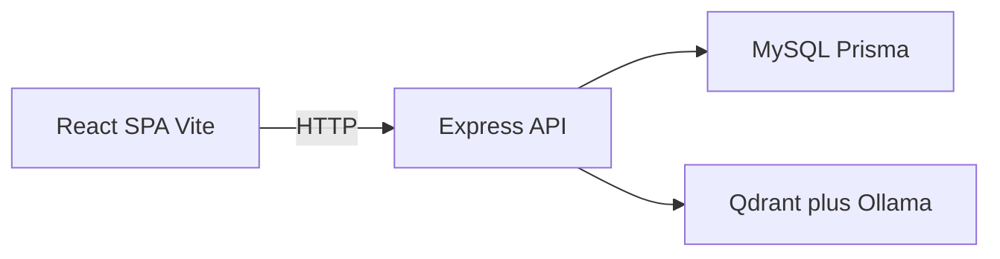

# Swinlearn

A full-stack learning management system (LMS) for **Swinburne University’s Vietnam campuses** (Hanoi, Da Nang, Ho Chi Minh City). It combines a traditional LMS (courses, curriculum, assignments, grades) with a Swinburne-branded public site, an AI study assistant, and a student community / gamification layer.

---

## Features

### Public marketing site

Located under `src/features/swinburne/`:

- Home, Courses, News, and Events pages
- Campus-oriented branding and content for Swinburne Vietnam

### Student workspace (`/student`)

- My courses with modules, assignments, grades, and course community
- Course registration against offerings and curriculum rules
- Calendar, inbox, help / consultations
- **SWINLEARN** AI study chat (grades, course knowledge, capabilities)
- Perfect CV builder from submitted student projects (Word / PDF export)
- Community posts, comments, likes, GIFs, and gamification (gold, badges)

### Teacher workspace (`/teacher`)

- Teaching courses with the same course-detail sections (home, modules, assignments, grades, community)
- Calendar, inbox, help requests, and approval-related requests
- Account / profile management

### Admin workspace (`/admin`)

- Course and curriculum administration
- Course offer configuration and registration approval
- User CRUD with campus filters and Excel import / export templates
- Requests, inbox, and account

### Cross-cutting capabilities

- Session-based auth with roles: `admin`, `teacher`, `student`
- Campuses: `hanoi`, `danang`, `hcm`
- Canvas course import into the content module system (`packages` → `modules` → `items` → `assets`)
- RAG over course knowledge via Qdrant + Ollama embeddings
- Grade analytics with PDF and XLSX report exports
- LLM intent routing (Groq / Gemini) for the study assistant

Full navigation and journey diagrams: [docs/user-flows.md](docs/user-flows.md) · [docs/user-flows.html](docs/user-flows.html)

---

## Tech stack

| Layer | Tech |
| --- | --- |
| Frontend | React 19, TypeScript, Vite 8, React Router 7, react-markdown + remark-gfm, FontAwesome |
| Backend | Node.js, Express 5, Multer (uploads), node-cron (scheduler) |
| Database | MySQL 8 via Prisma 6 ORM |
| Vector search / AI | Qdrant, Ollama embeddings (`nomic-embed-text`), Groq / Gemini for chat + intent routing |
| Document I/O | pdfkit, exceljs, officeparser, word-extractor |
| Dev infra | Docker Compose (mysql, qdrant, ollama, api, web), nodemon, ESLint |

---

## Architecture



**Frontend**

- `src/features/swinburne/**` — public marketing site
- `src/features/swinlearn/**` — authenticated workspace (student / teacher / admin)

**Backend** (`server/`)

- Route groups: `routes/auth.js`, `routes/workspace.js`, `routes/admin.js`
- Services layer for RAG indexing, intent routing, grade analysis, gamification scheduling, consultations, and related logic
- `server/docker-start.js` waits for dependencies, runs Prisma migrations, and optionally seeds demo data

---

## Repository layout

```text
swinlearn/
├── src/
│   ├── features/
│   │   ├── swinburne/     # Public marketing site
│   │   └── swinlearn/     # Workspace / LMS UI
│   └── ...
├── server/                # Express API
├── prisma/                # Schema, migrations, seeds
├── docs/                  # User flows and design notes
├── scripts/               # Windows helpers (stack, agentmemory)
├── design-system/         # Persisted UI design system
├── graphify-out/          # Codebase knowledge graph (agent tooling)
├── docker-compose.yml
├── docker-compose.agentmemory.yml
├── .env.example
└── package.json
```

---

## Prerequisites

- **Node.js** (LTS) and **npm**
- **Docker Desktop** (canonical local stack)
- Optional API keys:
  - `GROQ_API_KEY` — SWINLEARN chat / intent routing
  - Gemini keys — if you switch embedding provider from Ollama
  - `GIPHY_API_KEY` — community GIF search
- Optional: **agentmemory** for Cursor / Codex persistent memory (separate Compose file)

---

## Quick start

Canonical development path uses Docker Compose for the whole stack:

```bash
cp .env.example .env
# Set SESSION_SECRET to a long random value
# Optionally set GROQ_API_KEY (and GIPHY_API_KEY)

npm install
npm run dev
```

On Windows you can also double-click `scripts/start-stack.cmd`.

### Service URLs

| Service | URL |
| --- | --- |
| Web (Vite) | http://localhost:5173 |
| API (Express) | http://localhost:3001 |
| MySQL | localhost:3307 |
| Qdrant | http://localhost:6333 |
| Ollama | http://localhost:11434 |

Follow logs: `npm run dev:logs` · Foreground: `npm run dev:attach` · Stop: `npm run dev:down`

### Demo data

The API runs `prisma migrate deploy` on startup. It does **not** load demo courses or users by default.

To load the disposable demo seed:

```text
SWINLEARN_SEED_DEMO_DATA=true
```

Clear demo records later with `npm run prisma:clear-demo`.

### Deeper Docker / MySQL notes

Workbench connection, native MySQL escape hatch, stack repair, bind-mount hot reload, and agentmemory ops are documented in **[README.docker.md](README.docker.md)**.

Windows repair helper: `scripts/repair-stack.cmd` (or `npm run dev:repair`).

---

## Environment variables

Copy [`.env.example`](.env.example) to `.env`. Do not commit secrets.

| Group | Variables (representative) | Purpose |
| --- | --- | --- |
| Database / session | `DATABASE_URL`, `SESSION_SECRET`, `API_PORT`, `MYSQL_HOST_PORT`, `DOCKER_API_DATABASE_URL` | Persistence, auth sessions, host port mapping |
| Chat (Groq) | `GROQ_API_KEY`, `SWINLEARN_GROQ_MODEL`, `SWINLEARN_GROQ_VISION_MODEL`, `SWINLEARN_GROQ_CONTEXT_CHARS`, `SWINLEARN_MAX_FILE_MB` | Study chatbot |
| Embeddings / RAG | `SWINLEARN_EMBED_PROVIDER`, `OLLAMA_URL`, `SWINLEARN_EMBED_MODEL`, `SWINLEARN_EMBED_DIMS`, `QDRANT_URL`, `QDRANT_API_KEY`, `SWINLEARN_RETRIEVAL_TOP_K` | Local Ollama + Qdrant (Gemini embed option is commented in `.env.example`) |
| Community | `GIPHY_API_KEY` | GIF search proxy |
| Agentmemory (optional) | `AGENTMEMORY_URL`, `AGENTMEMORY_USE_DOCKER`, `AGENTMEMORY_III_VERSION` | Persistent agent memory server |

Default Docker MySQL credentials (local only): user `swinlearn`, password `password`, database `swinlearn`, host port `3307`.

---

## npm scripts

| Script | Description |
| --- | --- |
| `npm run dev` | Start full Docker Compose stack (build + detached) |
| `npm run dev:logs` | Tail `api` and `web` logs |
| `npm run dev:attach` | Foreground Compose (logs in the same terminal) |
| `npm run dev:repair` | `down --remove-orphans` then rebuild / up |
| `npm run dev:down` | Stop the stack |
| `npm run build` | Typecheck + Vite production build |
| `npm run lint` | ESLint |
| `npm run preview` | Preview production build |
| `npm run prisma:generate` | Generate Prisma client |
| `npm run prisma:migrate` | Create / apply migrations (`migrate dev`) |
| `npm run prisma:migrate:deploy` | Apply migrations (used in Docker startup) |
| `npm run prisma:seed` | Run demo seed (`prisma/seed.js`) |
| `npm run prisma:seed:rooms` | Seed consultation rooms only |
| `npm run prisma:clear-demo` | Remove demo users / courses |
| `npm run agentmemory:up` | Start optional agentmemory engine |
| `npm run agentmemory:down` | Stop agentmemory Compose project |
| `npm run agentmemory:logs` | Tail agentmemory logs |
| `npm run dev:native:api` / `dev:native:web` | Escape hatch without Compose (see README.docker.md) |

---

## Roles and main routes

### Public

| Path | Page |
| --- | --- |
| `/` | Home |
| `/courses` | Courses |
| `/news` | News |
| `/events` | Events |
| `/login` | Login |
| `/change-password` | Forced / account password change |

After login, users land on a role workspace home (or `/change-password` when required).

### Admin (`/admin`)

Default home: `/admin/courses`

| Path | Nav |
| --- | --- |
| `/admin/courses` | Courses |
| `/admin/course-offer` | Course Offer |
| `/admin/users` | Users |
| `/admin/requests` | Requests |
| `/admin/inbox` | Inbox |
| `/admin/account` | Account |

### Teacher (`/teacher`)

Default home: `/teacher/my-courses`

| Path | Nav |
| --- | --- |
| `/teacher/my-courses` | Teaching courses |
| `/teacher/my-courses/:courseId` | Course detail (home, modules, assignments, grades, community) |
| `/teacher/calendar` | Calendar |
| `/teacher/inbox` | Inbox |
| `/teacher/requests` | Requests |
| `/teacher/help` | Help |
| `/teacher/account` | Account |

### Student (`/student`)

Default home: `/student/my-courses`

| Path | Nav |
| --- | --- |
| `/student/my-courses` | My courses |
| `/student/my-courses/:courseId` | Course detail (same sections as teacher) |
| `/student/register` | Register |
| `/student/calendar` | Calendar |
| `/student/inbox` | Inbox |
| `/student/help` | Help |
| `/student/account` | Account |
| `/student/swinlearn` | SWINLEARN AI assistant |

---

## Core domains (backend)

- **Identity & access** — roles, profile status, campus, session auth
- **Academic model** — courses, majors, curriculum rules, prerequisites, offerings, staff assignments, sessions
- **Registration & enrolment** — pending / approved / rejected requests evaluated against curriculum and prerequisites
- **Assignments & content** — submissions plus modular course content; Canvas import pipeline
- **Grades & analytics** — GPA, bands, warnings, goals, remaining-average projection, PDF / XLSX exports
- **AI assistant** — threaded chat, attachments, knowledge indexes, intent router, RAG
- **Perfect CV** — LLM-assisted CV from student project submissions
- **Community** — posts, comments, likes, media, groups, connections
- **Inbox** — direct threads; help requests forwardable to teachers
- **Consultations & help** — bookable rooms and approval flows
- **Gamification** — gold economy, badges, share rewards (scheduled jobs)

A longer narrative summary lives in [PROJECT_SUMMARY.md](PROJECT_SUMMARY.md).

---

## Agent / contributor tooling

This repo is instrumented for AI-assisted development:

- **graphify** — knowledge graph under `graphify-out/` for scoped codebase queries
- **agentmemory** — optional cross-session memory (separate Compose; see [README.docker.md](README.docker.md#agentmemory-optional))
- **Skills stack** — superpowers (process / TDD), ui-ux-pro-max, design-taste-frontend, ponytail

Orchestration rules: [AGENTS.md](AGENTS.md) · [`.cursor/rules/skills-orchestration.mdc`](.cursor/rules/skills-orchestration.mdc)

Health check: `powershell -File scripts/verify-skills.ps1`

---

## Related docs

- [PROJECT_SUMMARY.md](PROJECT_SUMMARY.md) — architecture and domain overview
- [README.docker.md](README.docker.md) — Docker, MySQL Workbench, native MySQL, agentmemory
- [docs/user-flows.md](docs/user-flows.md) — role sitemaps and journeys
- [docs/user-flows.html](docs/user-flows.html) — interactive Mermaid companion
- [AGENTS.md](AGENTS.md) — agent / skill conventions
- [design-system/swinlearn/MASTER.md](design-system/swinlearn/MASTER.md) — UI design system
