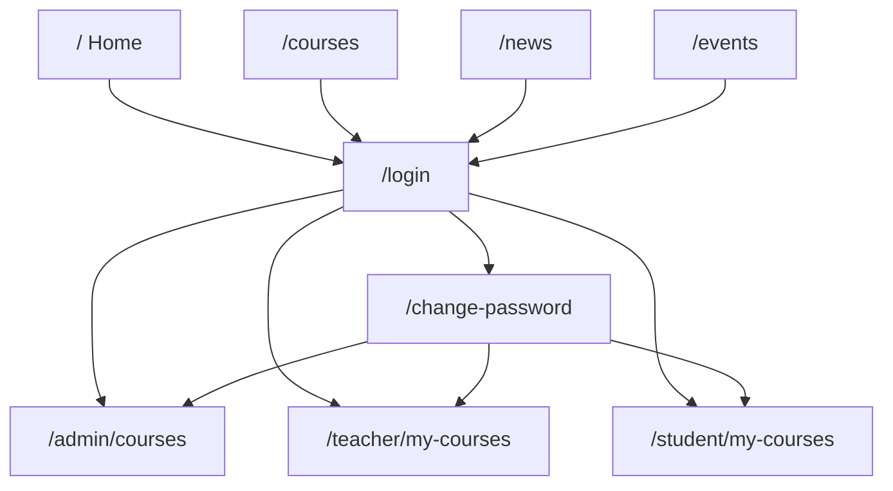
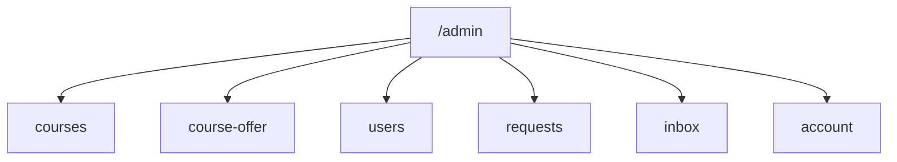
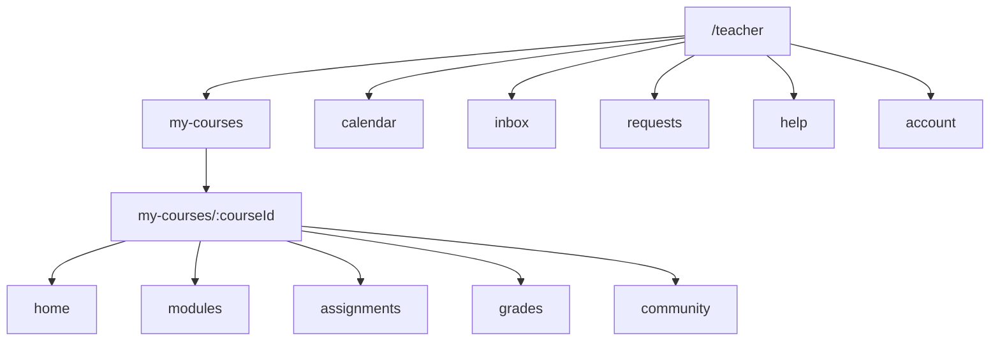
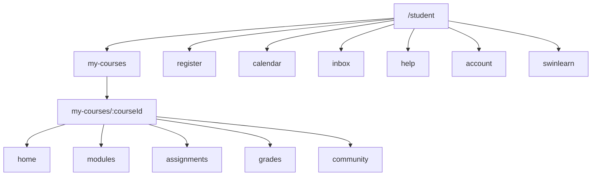
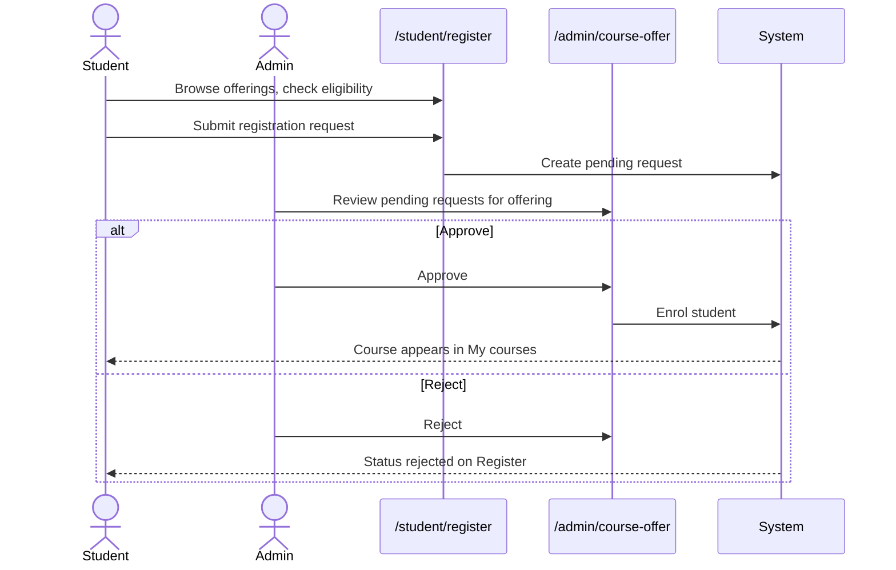
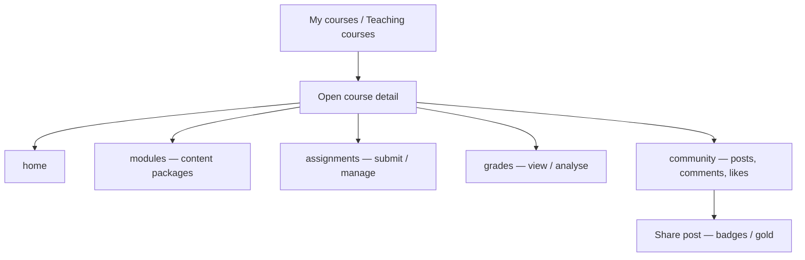
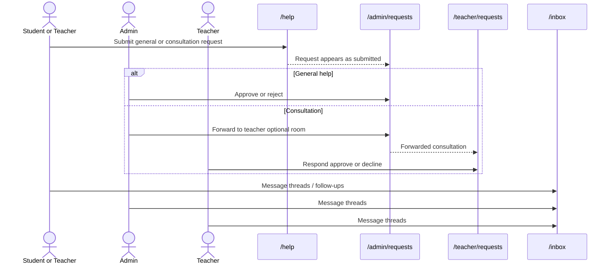
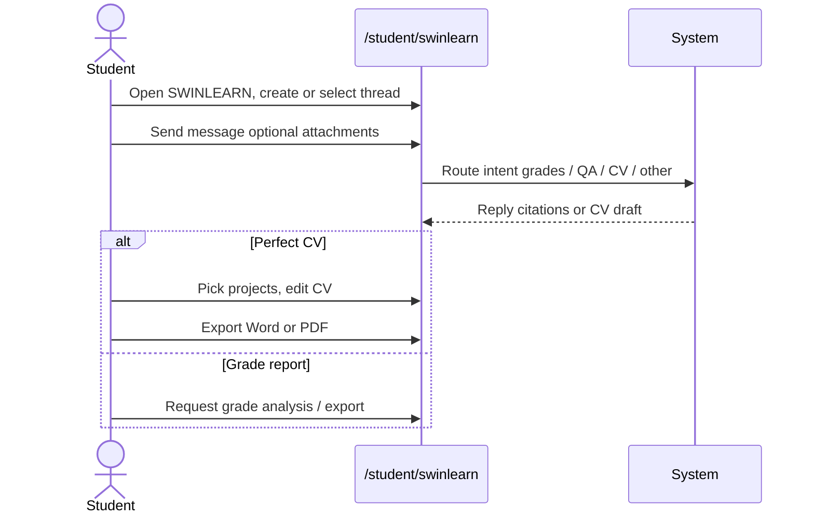
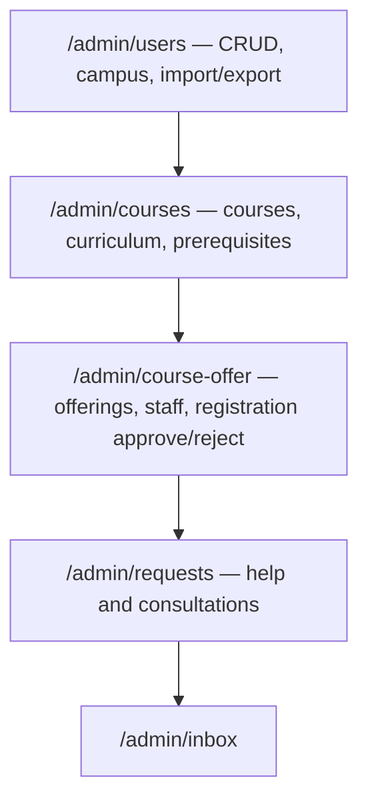

# Swinlearn user flows

As-is navigation and journeys for **admin**, **teacher**, and **student**. Grounded in current routes (`src/App.tsx`), workspace nav (`navigation.ts`), and course detail sections. Short **Gaps / future** notes call out missing or awkward pieces — not a redesign.

Companion view: [user-flows.html](./user-flows.html) (open in a browser; needs network for Mermaid CDN).

---

## 1. Shared entry

Public marketing site → login → optional forced password change → role workspace home.

---

## 2. Role sitemaps

### Admin (`/admin`)

Nav: Courses, Course Offer, Users, Requests, Inbox, Account. Default home: `/admin/courses`.

### Teacher (`/teacher`)

Nav: Teaching courses, Calendar, Inbox, Requests, Help, Account. Course detail sections nest under a course.

### Student (`/student`)

Nav: My courses, Register, Calendar, Inbox, Help, Account, SWINLEARN. Same course detail sections as teacher.

---

## 3. Cross-role journeys

### 3.1 Registration and approval

Student submits registration requests; admin approves or rejects on Course Offer (not the Admin Requests page).

### 3.2 Course learning loop

Shared course surface for enrolled students and assigned teachers. Community and share/gamification live inside the course.

### 3.3 Help, Inbox, and consultation requests

General help and consultations go through Admin Requests. Consultations can be forwarded to a teacher; teachers respond on Teacher Requests. Inbox handles messaging.

### 3.4 SWINLEARN AI and Perfect CV

Student-only workspace page: threaded chat with intent routing (grades, course knowledge, CV, capabilities) and Perfect CV edit/export.

### 3.5 Admin setup

Typical admin path to open offerings for registration: users → courses/curriculum → course offer (staff, offerings, registration approvals).

---

## 4. Gaps / future

- No dedicated student hub for pending registrations beyond the Register page itself.
- Community is course-scoped only (no global community nav item).
- SWINLEARN AI and Perfect CV are student-only; teachers/admins have no equivalent workspace page.
- Teacher Requests covers forwarded consultations, not course registration.
- Admin has no My courses / calendar / help nav items (help/requests are admin-facing via Requests).
- Course detail path uses optional `:section`; default section behaviour is app-defined — document consumers should treat `home` as the primary entry.
- Diagrams are maintained manually; update this file when routes or nav change.
